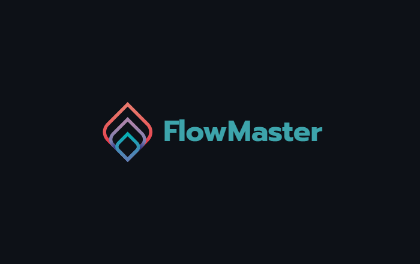

# ETL flow framework based on Yaml configs in Python

A light framework for creating data streams. 
Setting up streams through configuration in the Yaml file.
There is a schedule, task pools, concurrency limitation.
Works quickly, does not require a lot of resources. 
Runs on Windows and Linux.
Flow run in parallel via threading library. 
Internally SQLite Database.

At the moment there are connectors to sources
- Yandex Metrika Management API
- Yandex Metrika Stats API
- Yandex Metrika Logs API

Storages
- Save to file
- Clickhouse

## [Documentation](docs/main.md)

## Requirements
- python >=3.9
- virtual environment

## Settings

**It is highly recommended to install in a virtual environment.**

Flowmaster needs a home, '{HOME}/FlowMaster' is the default,\
but you can lay foundation somewhere else if you prefer\
(optional)

For Windows

    setx FLOWMASTER_HOME "{YOUR_PATH}"

For Linux

    export FLOWMASTER_HOME={YOUR_PATH}

## Installing
    pip install flowmaster==0.1.3

## Run
    flowmaster run

args

    flowmaster run --help

## Support

[Telegram chat](https://t.me/joinchat/QwbIth4XoR4zYzRi)

## Author
Pavel Maksimov

My contacts
[Telegram](https://t.me/pavel_maksimow),
[Facebook](https://www.facebook.com/pavel.maksimow)

Удачи тебе, друг! Поставь звездочку ;)
