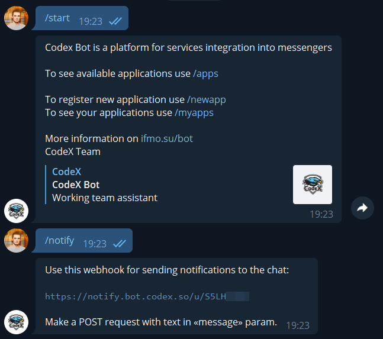

# Создание конфигурации ETL потока данных

Чтобы конфигурация была прочитана, в названии файла должен быть суффикс **.etl.flow.yaml**
Конфигурацию нужно поместить в **FlowMaster/notebooks**

Готовые примеры конфигураций потоков находятся [здесь](../../../examples/etl/)

```yaml
description: Описание потока

# Поставщик данных.
provider: Literal[
    "yandex_metrika_stats",
    "yandex_metrika_management",
    "yandex_metrika_logs",
    "yandex_direct",
    "csv",
    "sqlite",
    "postgres",
    "mysql",
    "flowmaster",
    "criteo",
    "google_sheets",
]
# Хранилище для вставки данных.
storage: Literal["clickhouse", "csv"]

# Политики работы потока.
work:
    # Политики запуска потока.
    triggers:
        # Политики расписания потока.
        schedule:
            # Интервал запуска потока.
            # Значения: daily, hourly или кол-во секунд.
            interval: Union[PositiveInt, Literal["daily", "hourly"]]  # обязательно
            # Таймзона времени запуска потока.
            timezone: str # Europe/Moscow  # обязательно
            # Время запуска потока.
            start_time: str # 00:00:00  # обязательно
            # Дата, с которой загрузить исторические данные..
            # Также влияет на то, будут ли загружены данные за пропущенные прошедшие дни, 
            # когда инструмент не работал.
            from_date: Optional[dt.date] = None # 2021-01-01 # опционально
            # Размер периода экспорта данных (кол-во интервалов).
            period_length: Optional[int] = 1

    # Оповещение о статусе выполнения потока.
    notifications:  # опционально
        # Оповещение о статусе выполнения потока в Телеграм ботом от Codex.
        codex_telegram:
            links: list[str]  # обязательно
            # Получать оповещения при возникновении ошибки.
            on_retry: bool = False  # опционально
            # Получать оповещения при успешном выполнении.
            on_success: bool = False  # опционально

    # Обновление данных за предыдущие дни. Есть два варианта.
    # Можно списком отрицательных чисел указать, за какой день назад, обновить данные.
    # update_stale_data: [-3, -5]
    # Или указать размер периода обновления. Обновит данные за 3 предыдущих дня.
    # update_stale_data: 3
    update_stale_data: Optional[Union[PositiveInt, list[NegativeInt]]] = None  # опционально

    # Кол-во перезапусков при ошибке.
    retries: int = 0  # опционально
    # Через сколько секунд перезапустить после ошибки.
    retry_delay: int = 60  # опционально
    # Ограничение работы по времени.
    # Время завершения работы потока, вычислится через добавление кол-ва указанных секунд к triggers.schedule.worktime
    time_limit_seconds_from_worktime: Optional[int] = None  # опционально
    # Ограничение продолжительности работы скрипта.
    soft_time_limit_seconds: Optional[int] = None  # опционально
    # Максимальное кол-во одновременных запущенных потоков.
    concurrency: int = 10  # опционально
    # Ограничивает выполнение в случае переполнения 
    # доступных слотов хотя бы в одном из указанных пулов.
    pools: Optional[list[str]] = None  # опционально

# Политика экспорта. Уникально для каждого поставщика данных.
export:
    ...

# Политика загрузки данных в хранилище. Уникально для каждого хранилища.
load:
    ...

# Политика преобразования данных для загрузки в хранилище. 
# Уникально для каждого хранилища.
transform:
    ...
```


### Политика интервала запуска потока (work.triggers.schedule.interval)

Значения: **daily**, **hourly** или **кол-во секунд**.

Если указано **daily** или **hourly**, то поток данных заказывается за предыдущий интервал.\
Например вы указали **start_time: 00:00:00**, а текущее время **2021-01-02 00:00:15**:
- При **interval: daily**, поток будет заказан за предыдущую дату **2021-01-01 00:00:00**
- При **interval: 86400** (сутки) поток будет заказан за текущую дату **2021-01-02 00:00:00**

### Политики экспорта данных (export)
Описание доступно по ссылкам
- [yandex_metrika_stats](yandex_metrika_stats.md)
- [yandex_metrika_management](yandex_metrika_management.md)
- [yandex_metrika_logs](yandex_metrika_logs.md)
- [yandex_direct](yandex_direct.md)
- [csv](provider-csv.md)
- [sqlite](provider-sqlite.md)
- [postgres](provider-postgres.md)
- [mysql](provider-mysql.md)
- [flowmaster](provider-flowmasterdata.md)
- [criteo](provider-criteo.md)
- [google_sheets](provider-google-sheets.md)


### Политики загрузчика в хранилище (load)
Описание доступно по ссылкам
- [clickhouse](clickhouse.md)
- [csv](loader-csv.md)


### Политики оповещения о работе потока (work.notifications)
#### Оповещение в Telegram через бот codex_telegram

Найдите и активируйте [бота](https://t.me/codex_bot) в Телеграм

    @codex_bot

Далее отправьте в чат сообщение

    /notify

он выдаст ссылку, по которой слать ему сообщения.
Ее надо добавить в политику **links**. Можно добавлять несколько.
```yaml
work:
    notifications:
        codex_telegram:
            links: ["https://notify.bot.codex.so/u/S5LH"]
```


