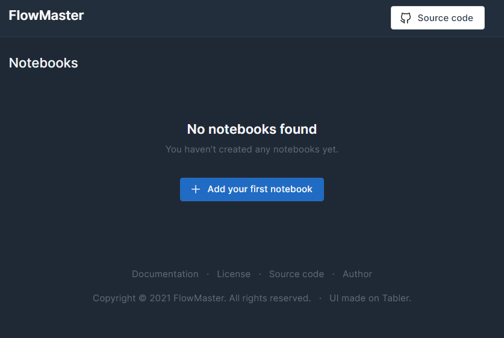
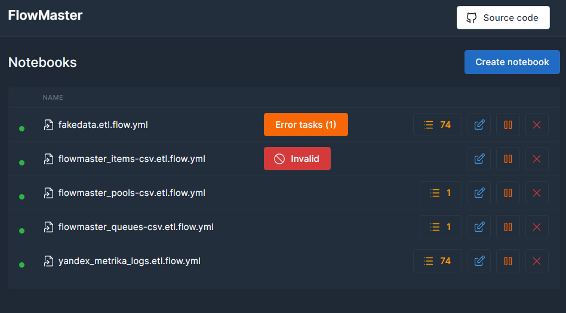
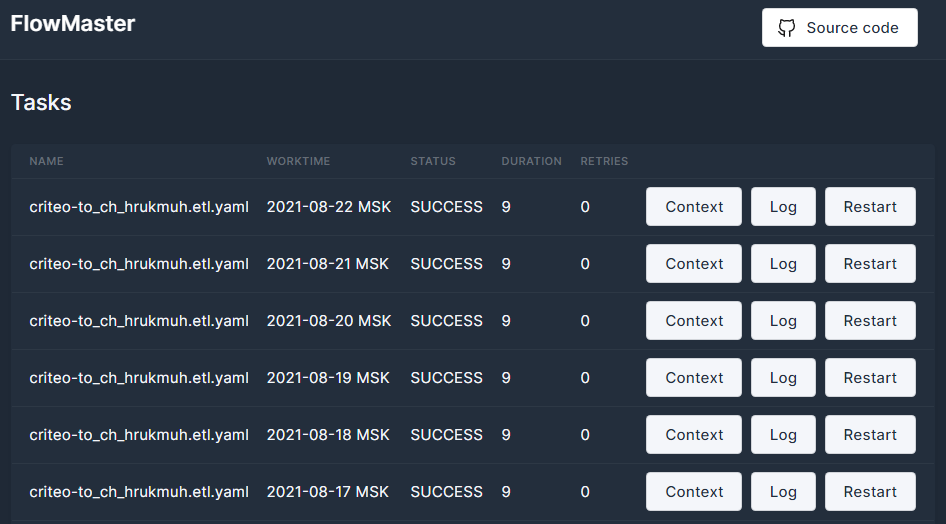

В первую очередь вам необходимо запустить FLowmaster

    flowmaster run

По умолчанию на порту 8822 будет доступен веб интерфейс. 
Передите в браузере по ссылке http://localhost:8822

Далее создайте конфигурацию (notebook) потока данных.
- [Как создать конфигурацию потока данных](notebooks/etl/base.md)

Число 27, это число выполненных плановых работ. 
Если кликнуть, то откроется страница с ними.
Если говорить про оператор ETL, для него одна плановая работа это дата, 
за которую необходимо выполнить скрипт.
Несколько плановых работ могут выполнены в одной задаче для оператора ETL, 
если это указано в политике `period_length`.

Также здесь есть кнопки остановки/запуска, редактирования и удаления конфигурации потока.

Еще тут появляются предупреждения, если будут невыполненные плановые работы 
и если ваша конфигурация невалидна

Плановые работы

Задавайте вопросы в чате [Telegram](https://t.me/joinchat/DhWJYG_yECYyYTEy)
